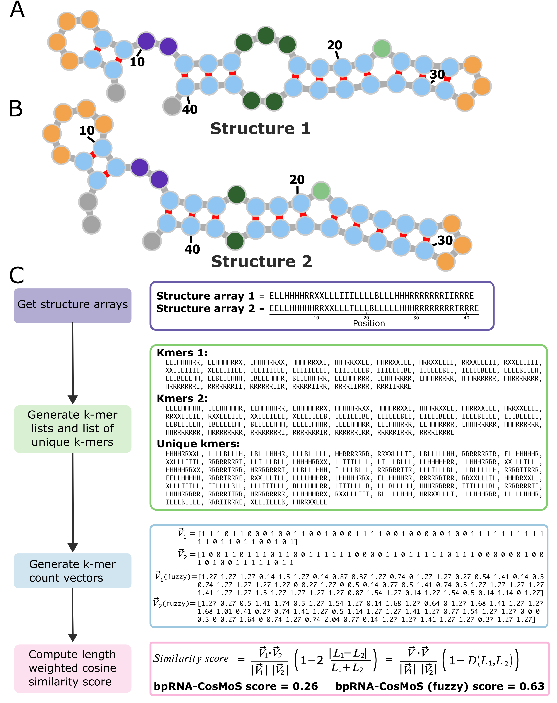

# bpRNA-CosMoS
bpRNA-CosMoS is a novel RNA secondary structure comparison method involving a k-mer based, length weighted cosine similarity approach. This method uses the bpRNA structure array as an input, which provides a feature rich structural representation. This k-mer based approach achieves low time-complexity, which enables fast application for large data sets. 

## bpRNA-CosMoS scripts
bpRNA_CosMoS has two python scripts, one that processes the input file (a file containing paths to RNA .dbn or .st files) and generates the output score file (bpRNA_CosMoS.py), and one that performs the comparison method (bpRNA_CosMoS_module.py). Th

## bpRNA_CosMoS.py: 
This script takes one required input and has multiple flag options and outputs the scoring result file. The output file has three columns, two for the names of the RNAs being compared, and one for the similarity score between the two RNAs (eg. name_1, name_2, score). input 1) -f, a file containing the structural file paths, where the structural files are either in ".st" format or ".dbn" format (ex. test_RNA_paths.txt). flag options include -a (to apply the fuzzy option), -mp (to utilize multiprocessing), -c (to specify the number of cores to use in multiprocessing), -o (to specify the base name of the output file)

## bpRNA_CosMoS_module.py: 
This module performs the comparison task, once the files are processed and the key information is retrieved. 
This module includes the a length weighted cosine similarity score and the optional pseudo counts for scoring. 

An example run file for bpRNA-align is available, "run_bpRNA_CosMoS.sh", and can be run using the following command: "bash run_bpRNA_CosMoS.sh"

## Acknowledgements: 
This comparison method utilizes bpRNA structure arrays as the input. These can be generated using the bpRNA method/tool developed previously: [bpRNA: large-scale automated annotation and analysis of RNA secondary structure](https://academic.oup.com/nar/article/46/11/5381/4994207). The bpRNA_CosMoS.py script makes use of the bpRNA tool to convert .dbn to .st files. For more information about bpRNA, check out the [github repository](https://github.com/hendrixlab/bpRNA).

